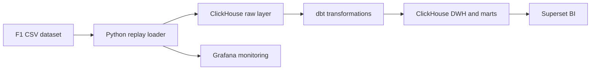
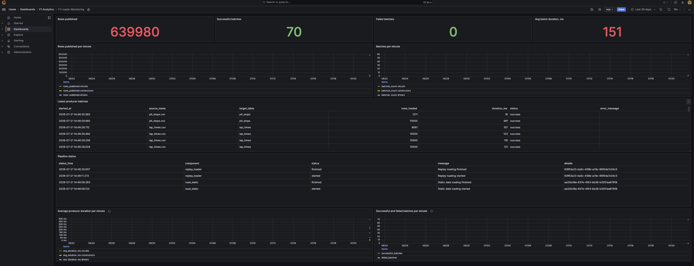
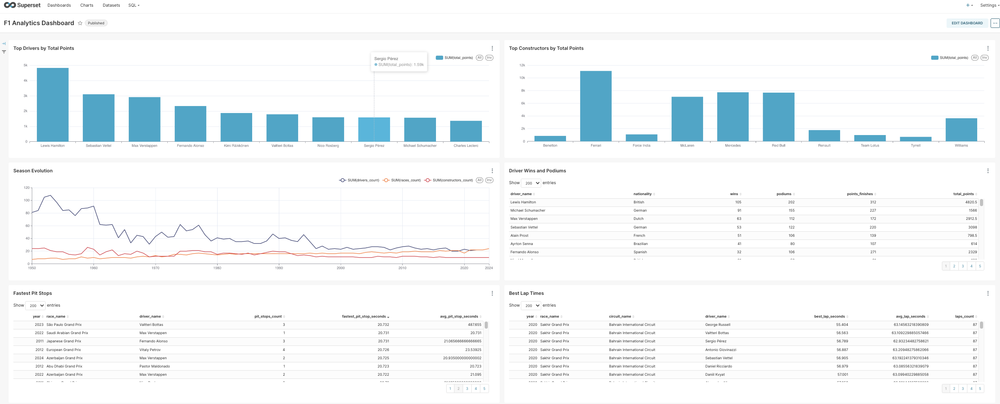

# F1 ClickHouse Analytics

[](https://github.com/AlChernoff/f1-clickhouse-analytics/actions/workflows/quality.yml?query=branch%3Amain)

Local analytics platform for Formula 1 data: Python loads CSV files into ClickHouse, dbt builds analytical views, Grafana monitors ingestion, and Superset presents dashboards.

## Quick start

Run commands from this directory.

```bash
cp .env.example .env
make check-data
make demo
```

`make demo` removes local Docker volumes, loads the data, builds dbt models, and initializes the Superset dashboard.

Afterward, inspect the result with:

```bash
make demo-show
```

Useful URLs:

- Grafana: <http://localhost:3000>
- Superset: <http://localhost:8088>

Default local credentials are defined in `.env` (`admin` / `admin` in `.env.example`).

## Daily commands

```bash
make up                    # start services
make load                  # load dimensions and replay event data
make transform             # run dbt build
make replay TABLE=results  # replay one event table
make clean-data            # delete loaded data, retain Docker volumes
make lint                  # run Python static checks
make test                  # run loader unit tests
make ci                    # run local preflight checks
```

Run `make help` to see the complete public command list. Detailed operational guidance is in [docs/runbook.md](docs/runbook.md); the presentation flow is in [docs/demo_script.md](docs/demo_script.md).

## Data source

The project uses the Formula 1 World Championship dataset from [Kaggle](https://www.kaggle.com/datasets/rohanrao/formula-1-world-championship-1950-2020). See [data/raw/README.md](data/raw/README.md) for the required files and source-data licensing notes.

## What this project demonstrates

- configurable replay ingestion from historical CSV files;
- ClickHouse raw tables with ReplacingMergeTree deduplication;
- dbt staging, DWH, and mart modelling with data-quality tests;
- operational observability through loader monitoring tables and Grafana;
- reproducible local setup with Docker Compose, lockfiles, unit tests, and static checks.

## Architecture



```text
F1 CSV Dataset
      ↓
Python Replay Loader
      ↓
ClickHouse RAW Layer
      ↓
dbt Transformations
      ↓
ClickHouse DWH and MARTS
      ↓
Grafana Monitoring and Superset BI
```

## Dashboards

### Grafana monitoring



### Superset analytics



## License

Distributed under the [MIT License](LICENSE).

## Presentation

- [Project presentation](presentation/f1_clickhouse_project_defense.pptx)
- [Speaker notes](presentation/speaker_notes.md)
